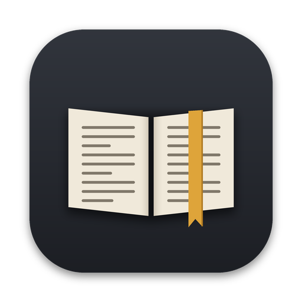
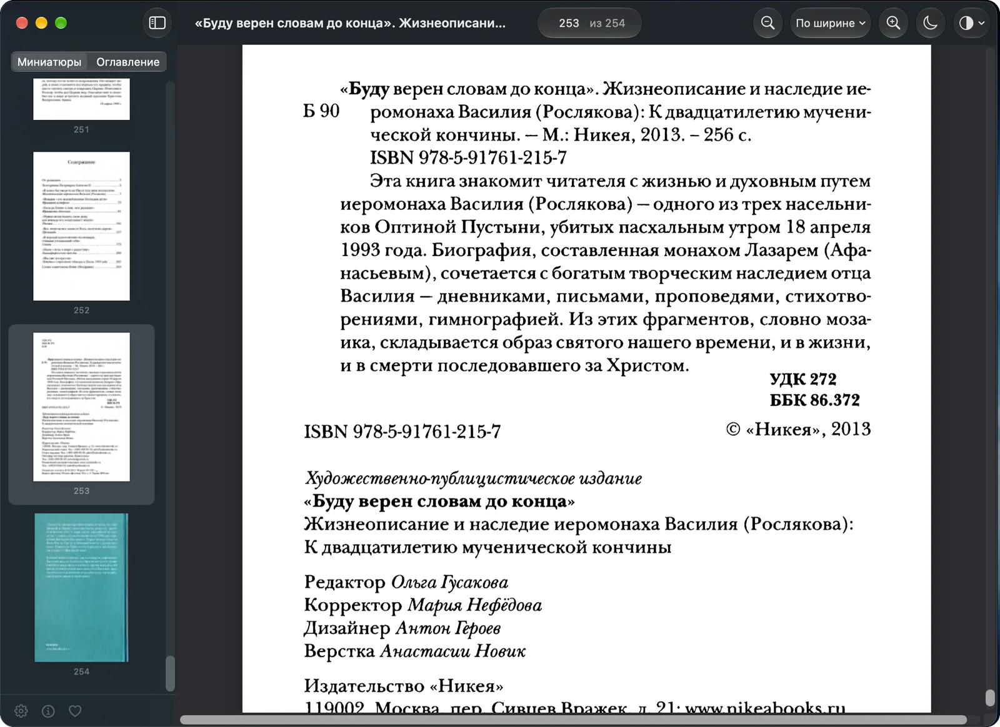

  

<h1 align="center">DjVu Reader</h1>

<h3 align="center">Scanned books, sharp at any zoom.</h3>

  A native DjVu reader for the Mac — free and open source.

  <a href="https://github.com/akeisoft/DjVuReader/releases/latest/download/DjVuReader.dmg"><b>⬇&nbsp;&nbsp;Download for Mac</b></a>
  &nbsp;&nbsp;·&nbsp;&nbsp;
  <a href="https://akeisoft.com">akeisoft.com</a>

  
  
  
  
  

  

---

DjVu is the format of countless scanned books, journals and old documents. **DjVu Reader** opens them the way a Mac app should: instantly, with crisp text at any zoom, and without pulling a 2,000-page book into memory.

<table>
  <tr>
    <td align="center" width="33%">⚡ <b>Fast</b> A 2,000-page book opens as quickly as a 20-page one: only the pages near the screen stay in memory.</td>
    <td align="center" width="33%">🔍 <b>Sharp</b> Pages are drawn in tiles at your screen's resolution, so text stays crisp at any zoom.</td>
    <td align="center" width="33%">🔓 <b>Open</b> Free software under the GPL, built on DjVuLibre. Works completely offline.</td>
  </tr>
</table>

## What it does

| | |
|:--|:--|
| 📂&nbsp;**Opens it all** | `.djvu` and `.djv`, single-file and multi-file — double-click, File → Open, or drag and drop. Tabs, Recent Documents and window restoration, the native way |
| 📜&nbsp;**Continuous reading** | One smooth scroll through the whole book |
| 🔎&nbsp;**Zoom your way** | Fit width, full page or actual size; pinch on the trackpad; double-tap with two fingers to zoom to the page width under the pointer, double-tap again to zoom back |
| 🗂️&nbsp;**Find your place** | Thumbnails and the book's table of contents in the sidebar, with the book's own page labels such as “iv (12)” |
| 🌙&nbsp;**Night mode** | Warm light gray on graphite — easy on the eyes, not harsh white on black |
| 🧼&nbsp;**Clean scans** | Black and white keeps only the text and drops the gray background and dirt; background-only and foreground-only views as well |
| 📋&nbsp;**Copy text** | Copy a page's text when the file has a text layer |
| 🔖&nbsp;**Remembers** | Page, zoom and display mode are saved for every file |

## Keyboard

| Action | Keys |
|:--|:--|
| Fit width · Full page · Actual size | <kbd>⌘1</kbd> · <kbd>⌘2</kbd> · <kbd>⌘0</kbd> |
| Zoom in · Zoom out | <kbd>⌘=</kbd> · <kbd>⌘−</kbd> |
| Go to page | <kbd>⌥⌘G</kbd> |
| Next · Previous page | <kbd>⌥⌘↓</kbd> · <kbd>⌥⌘↑</kbd> |
| First · Last page | <kbd>⌘↑</kbd> · <kbd>⌘↓</kbd> |
| Page by page | <kbd>←</kbd> · <kbd>→</kbd> |
| Screen by screen | <kbd>Space</kbd> · <kbd>⇧Space</kbd> |
| Night mode | <kbd>⇧⌘N</kbd> |
| Copy page text | <kbd>⇧⌘C</kbd> |

## Requirements

- macOS 14 Sonoma or later, on Apple Silicon or Intel
- Русский, Українська, English — switch in Settings

## Build from source

You need macOS 14 or later and Xcode 16 or later.

1. Clone the repository and open `DjVuReader.xcodeproj`.
2. Press <kbd>⌘R</kbd>. The project signs to run locally, so it starts right away; for a release, choose your team in Signing & Capabilities.

Good to know:

- `Sources`, `Resources` and the DjVuLibre source folders are synchronized with the disk: new files appear in Xcode by themselves.
- The Release build is universal (Apple Silicon and Intel); Debug builds only for your Mac.
- `Scripts/test-bridge.sh` checks the DjVuLibre bridge without Xcode: it compiles the library and runs a self-test on `Tests/Fixtures/sample.djvu`.

## License

DjVu Reader is free software under the GNU General Public License, version 2 or later — see [LICENSE](LICENSE). It includes DjVuLibre 3.5.30 (GPL 2.0 or later): its source code is part of this repository and is built together with the app.

---

  
    © 2026 <a href="https://akeisoft.com">AKEISOFT</a> · More Mac apps:
    <a href="https://akeisoft.com/#mac64">MAC64</a> ·
    <a href="https://github.com/akeisoft/GeoScreen64">GeoScreen64</a>
  

